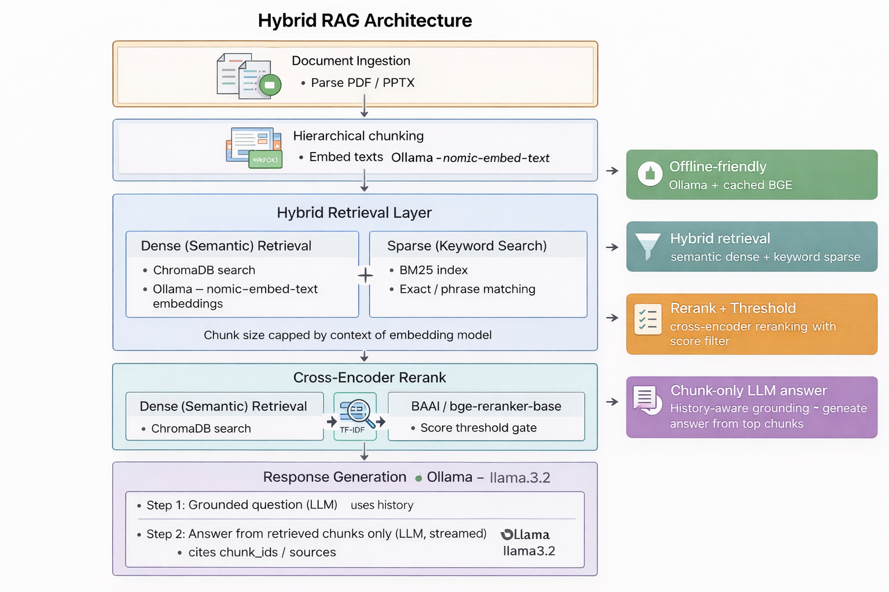

# RAG System (Retrieval-Augmented Generation)

A modular, session-based RAG system that lets users upload documents (PDF, PPTX), chunk and embed them, then ask questions and get grounded answers from an LLM using only the retrieved chunks. Includes a web UI (email → upload → chat) and programmatic APIs.

---

## Table of Contents

- [Features](#features)
- [Architecture](#architecture)
- [Request Flow](#request-flow)
- [Project Structure](#project-structure)
- [APIs](#apis)
- [Installation](#installation)
- [Configuration](#configuration)
- [Usage](#usage)
- [Offline Use](#offline-use)
- [Testing](#testing)
- [Test scripts and suites](#test-scripts-and-suites)
- [Module READMEs](#module-readmes)

---

## Features

- **Document ingestion**: PDF and PPTX support; hierarchical chunking (paragraphs → lines → sentences → tokens) with configurable chunk size; chunk size capped to embedding model context (e.g. 512 for mxbai-embed-large).
- **Embeddings**: Ollama or OpenAI; collection name scoped by embedding model to avoid dimension mismatch when switching models.
- **Retrieval**: Hybrid search (dense vector + sparse BM25) → BGE cross-encoder rerank → score threshold; BGE model loaded once per process and cached.
- **Response generation**: History-aware query grounding, then chunk-grounded answer; supports streaming; configurable LLM (Ollama / OpenAI).
- **Document UI**: Session by email (case-insensitive); upload and process files; “Talk with your files” chat with streaming, markdown-style formatting (bold, bullets, subheadings), and placeholders (“Searching documents…”, “Generating answer…”).
- **Offline-friendly**: Reranker uses local BGE cache; Ollama uses `127.0.0.1` to avoid DNS; optional Hugging Face offline env vars.

---

## Architecture

The system has two main flows: **ingestion** (document → chunks → embeddings → store) and **query** (question → retrieve chunks → generate answer). Both use a single **`config.yaml`** and shared **common** components (config loader, embeddings).

<!-- Add your architecture diagram under docs/ and uncomment the line below -->
<!--  -->



### Flow summary

| Flow | Entry | Steps | Output |
|------|--------|--------|--------|
| **Ingestion** | User uploads PDF/PPTX via UI (or `ingest_document()` in code) | Document UI saves file → background job runs **chunk_embed_store**: parse → chunk (size capped by embedding model) → **common.embed_texts** → store in **ChromaDB** (session DB, collection name from config). | Chunks and embeddings in ChromaDB; session file list updated. |
| **Query** | User sends a question in chat (or `GroundedRAGPipeline.ask()` in code) | **RetrieverAgent**: embed question (**common.embed_query**) → **hybrid search** (dense + BM25) on ChromaDB → **BGE rerank** (model cached) → score threshold → top chunks. **ResponseGenerator**: ground question (LLM) → generate answer from chunks (LLM, optional stream). | Answer (and sources) returned or streamed to UI. |

### Components (modularity)

| Component | Role |
|-----------|------|
| **`src/common`** | `load_config`, `get_effective_collection_name`, `embed_texts`, `embed_query` (Ollama/OpenAI). Used by all other modules. |
| **`src/chunk_embed_store`** | Ingest: parse PDF/PPTX → hierarchical chunking → embed (common) → ChromaDB. Chunk size capped by embedding model context. |
| **`src/retriever_agent`** | Retrieve: embed query (common) → hybrid search → BGE rerank (cached) → filter by score threshold → return chunks. |
| **`src/response_generator`** | Ground question with history; generate answer from chunks only (Ollama/OpenAI, stream optional). Prompts in `metadata/prompts.yaml`. |
| **`src/document_ui`** | Flask app: session by email → upload (triggers chunk_embed_store) → chat (GroundedRAGPipeline: retriever + response_generator). Session ChromaDB under `sessions/<hash>/chroma_db`. |

**Adding a diagram:** Create `docs/architecture.png` (or `.svg`), then in this section uncomment the line: ``.

---

## Request Flow

### User asks a question in the chat UI

1. **Browser** → `POST /api/chat/stream` with `{ question }`.
2. **Document UI** (`app.py`): Validates session and question; gets or creates `GroundedRAGPipeline` for that session (uses session-specific `config_path` so ChromaDB points to `sessions/<hash>/chroma_db`).
3. **GroundedRAGPipeline.ask_stream**:
   - **RetrieverAgent.retrieve(question)**  
     - Embed question (common embeddings, Ollama/OpenAI).  
     - Hybrid search on session’s ChromaDB (dense + sparse).  
     - BGE rerank (cached model), apply score threshold.  
     - Return list of chunks.
   - **ResponseGenerator.generate_stream**  
     - Ground question using conversation history (one LLM call).  
     - Stream answer from chunks (second LLM call, streamed).
4. **Backend** streams NDJSON: `{"type":"chunk","content":"..."}` then `{"type":"done","sources":[...]}`; appends turn to in-memory chat history.
5. **Browser** shows “Searching documents…” then “Generating answer…”, then streamed text; on `done` renders markdown (bold, bullets, headings) and sources.

### User uploads a file

1. **Browser** → `POST /api/process` with file.
2. **Document UI**: Validates session; saves file under `uploads/`; starts background job; returns `job_id`.
3. **Background job** (`_run_ingestion_job`): Builds session config (Chromadb `db_path` = session’s `chroma_db`), calls **chunk_embed_store.ingest_document(file_path, config_path)**.
4. **chunk_embed_store**: Parse → chunk (size capped by embedding model) → embed (common) → store in session’s ChromaDB (collection name from config).
5. **Document UI**: Updates session’s file list; frontend polls `GET /api/process/<job_id>/status` until completed.

### Session persistence (same email, later visit)

- Session ID = hash of **normalized email** (lowercase). Same email always maps to same `sessions/<hash>/chroma_db`.
- On `POST /api/session/start`, if the session is not in memory, **existing files** are loaded from ChromaDB (primary collection by current embedding model; fallback to any collection in that DB). So previously uploaded chunks are shown again.

---

## APIs

All APIs below are served by the **Document UI** Flask app when you run `python -m src.document_ui.app`. Base URL is typically `http://localhost:8000`. Session is tracked via Flask session cookie (set after `POST /api/session/start`).

### Pages (HTML)

| Method | Path | Description |
|--------|------|-------------|
| `GET` | `/` | Email entry page; start a session. |
| `GET` | `/upload` | Upload and manage documents; requires active session. |
| `GET` | `/chat` | Chat with your files; requires active session and at least one uploaded file. |

### Session

| Method | Path | Request | Response | Description |
|--------|------|---------|----------|-------------|
| `POST` | `/api/session/start` | `JSON: { "email": "user@example.com" }` | `201` `{ "redirect": "/upload" }` or `400` `{ "error": "..." }` | Start or resume session. Email is normalized (lowercase) for stable session ID. |
| `POST` | `/api/session/end` | `JSON: { "delete_data": false }` (optional) | `200` `{ "message": "Session closed." }` | End current session; optionally delete session directory when `delete_data: true`. |

### Upload and process

| Method | Path | Request | Response | Description |
|--------|------|---------|----------|-------------|
| `POST` | `/api/process` | `multipart/form-data`: `file` (PDF/PPT/PPTX) | `202` `{ "job_id": "uuid" }` or `400`/`404` with `error` | Start background ingestion (chunk + embed + store in session ChromaDB). |
| `GET` | `/api/process/<job_id>/status` | — | `200` `{ "state", "progress", "message", "chunks_created?", "error?" }` or `404` | Poll job status until `state` is `completed` or `failed`. |

### Session files

| Method | Path | Request | Response | Description |
|--------|------|---------|----------|-------------|
| `GET` | `/api/session/files` | — | `200` `{ "files": [{ "file_name", "chunks_created" }], "email" }` or `400`/`404` | List files processed in this session. |
| `DELETE` | `/api/session/files/<file_name>` | — | `200` `{ "message": "Deleted N chunks for <file_name>" }` or `400`/`404`/`500` with `error` | Delete all chunks for the given file from session ChromaDB. Use encoded `file_name` in URL. |

### Chat

| Method | Path | Request | Response | Description |
|--------|------|---------|----------|-------------|
| `GET` | `/api/chat/history` | — | `200` `{ "messages": [{ "question", "answer", "sources" }], "email" }` or `400`/`404` | Get chat history for the current session. |
| `POST` | `/api/chat` | `JSON: { "question": "Your question?" }` | `200` `{ "question", "answer", "sources": [{ "chunk_id" }] }` or `400`/`500` with `error` | One-shot RAG: retrieve + generate answer (non-streaming). |
| `POST` | `/api/chat/stream` | `JSON: { "question": "Your question?" }` | `200` NDJSON stream: `{"type":"chunk","content":"..."}` then `{"type":"done","sources":[...]}` or `{"type":"error","error":"..."}` | Streaming RAG: same as above but response is newline-delimited JSON stream. |

**Notes:**

- All `/api/*` endpoints (except session start) require an active session; otherwise `400` with `"No active session"` or `"Session expired"`.
- For chat, the session must have at least one processed file; otherwise `400` with `"Upload at least one document before chatting."`.

---

## Project Structure

```
.
├── config.yaml                 # Global config (embedding, ollama, chromadb, chunking, retriever, response_generator)
├── requirements.txt
├── README.md                   # This file
├── src/
│   ├── common/                 # Shared config and embeddings
│   │   ├── config.py           # load_config, get_effective_collection_name, DEFAULT_CONFIG
│   │   └── embeddings.py      # embed_texts, embed_query (Ollama/OpenAI)
│   ├── chunk_embed_store/      # Ingest: parse → chunk → embed → ChromaDB
│   │   ├── pipeline.py        # ingest_document; chunk size cap by embedding model
│   │   ├── chunker.py
│   │   ├── store.py
│   │   ├── embedder.py
│   │   └── ...
│   ├── retriever_agent/        # Hybrid search + BGE rerank (model cached)
│   │   ├── pipeline.py        # RetrieverAgent
│   │   ├── vector_search.py   # get_collection, hybrid_search
│   │   ├── reranker.py        # BGE CrossEncoder cache
│   │   └── ...
│   ├── response_generator/     # Ground question + generate answer (streaming optional)
│   │   ├── pipeline.py        # ResponseGenerator (generate, generate_stream)
│   │   ├── orchestrator.py   # GroundedRAGPipeline (ask, ask_stream)
│   │   ├── metadata/
│   │   │   └── prompts.yaml   # grounding_prompt, response_prompt
│   │   └── ...
│   ├── document_ui/            # Flask UI: email → upload → chat
│   │   ├── app.py             # Routes, session state, chat stream, ingest job
│   │   ├── templates/
│   │   └── static/
│   └── tests/
├── sessions/                   # Per-session ChromaDB (created at runtime; in .gitignore)
├── uploads/                    # Uploaded files (created at runtime; in .gitignore)
└── chroma_db/                  # Default ChromaDB path if not using UI (in .gitignore)
```

---

## Installation

### Prerequisites

- **Python 3.11+**
- **Ollama** (for local embeddings and LLM): [ollama.ai](https://ollama.ai). Start the service (e.g. `ollama serve` or use the installed app).
- For **OpenAI** instead: set `provider` and `api_key` in `config.yaml` (or env) for `embedding` and/or `response_generator`.

### Steps

1. **Clone the repository** (or use your project root).

2. **Create a virtual environment and install dependencies:**

   ```bash
   python -m venv venv
   # Windows:
   venv\Scripts\activate
   # Linux/macOS:
   source venv/bin/activate

   pip install -r requirements.txt
   ```

3. **Install and run Ollama** (if using Ollama):
   - Download from [ollama.ai](https://ollama.ai).
   - Pull the embedding model and LLM used in config, e.g.:
     ```bash
     ollama pull nomic-embed-text
     ollama pull llama3.2
     ```

4. **BGE reranker (first run with internet):**
   - In `config.yaml`, set `retriever.reranker.local_files_only: false`.
   - Run one retrieval (e.g. open Document UI, upload a file, ask a question) so the BGE model is downloaded.
   - Set `local_files_only: true` again for offline use.

5. **Configuration:** Copy or edit `config.yaml` in the project root (see [Configuration](#configuration)).

---

## Configuration

All behavior is driven by **`config.yaml`** at the project root.

| Section | Key examples | Description |
|--------|----------------|-------------|
| **embedding** | provider, model, api_key | Ollama or OpenAI; model name; optional API key. |
| **ollama** | base_url | Use `http://127.0.0.1:11434` for offline. |
| **chromadb** | db_path, collection_name, embedding_scoped_collection | DB path; collection name; if true, collection name includes embedding model (avoids dimension mismatch). |
| **chunking** | chunk_size_tokens, overlap_sentences | Max tokens per chunk (ingest pipeline caps this by embedding model’s max context). |
| **retriever** | dense_top_k, sparse_top_k, hybrid_top_k, final_top_k, score_threshold, dense_weight, sparse_weight | Retrieval sizes and weights. |
| **retriever.reranker** | provider, model, local_files_only | BGE model name; true = use cache only (offline). |
| **response_generator** | provider, model, temperature, max_tokens, history_keep, metadata_path | LLM for grounding and answer; prompts file. |

See **`src/common/config.py`** for `DEFAULT_CONFIG` and **`get_effective_collection_name`** (collection name derived from embedding model when `embedding_scoped_collection` is true).

---

## Usage

### Document UI (recommended for end users)

1. **Start the app:**

   ```bash
   python -m src.document_ui.app
   # or
   flask --app src.document_ui.app run
   ```

   Default: `http://0.0.0.0:8000` (or the URL shown).

2. **Flow:**
   - Open the URL → enter **email** → start session.
   - **Upload** PDF or PPTX → wait for processing (chunk + embed + store in session ChromaDB).
   - Click **“Talk with your files”** → ask questions; answers are streamed and rendered with markdown (bold, bullets, subheadings). Session and uploaded chunks persist by email (case-insensitive).

### Programmatic use (ingest + retrieve + answer)

- **Ingest a document:**

  ```python
  from src.chunk_embed_store import ingest_document
  ingest_document("path/to/file.pdf", config_path="config.yaml")
  ```

- **Retrieve chunks:**

  ```python
  from src.retriever_agent import RetrieverAgent
  agent = RetrieverAgent(config_path="config.yaml")
  result = agent.retrieve("Your question?")
  for c in result.chunks:
      print(c.chunk_id, c.rerank_score, c.text[:200])
  ```

- **Full RAG (retrieve + generate answer):**

  ```python
  from src.response_generator import GroundedRAGPipeline
  pipeline = GroundedRAGPipeline(config_path="config.yaml")
  response = pipeline.ask(session_id="my-session", question="Your question?")
  print(response.response)
  print(response.context_chunk_ids)
  ```

  For streaming, use `pipeline.ask_stream(session_id, question)` and consume the generator.

---

## Offline Use

- **Ollama:** Set `ollama.base_url` to `http://127.0.0.1:11434` (no DNS).
- **BGE reranker:** Set `retriever.reranker.local_files_only: true` (default). Run once online to download the model, then use offline.
- **HF env:** The retriever sets `HF_HUB_OFFLINE` / `TRANSFORMERS_OFFLINE` when using the reranker with `local_files_only`, so Hugging Face is not contacted after the model is cached.

---

## Testing

Run all tests from the project root (with the virtual environment activated):

```bash
python -m pytest src/tests/ -v
```

Module-level READMEs (see below) may describe extra test or usage details.

---

## Test scripts and suites

### Standalone test script

| Script | How to run | Tests performed |
|--------|------------|-----------------|
| **`scripts/test_multi_user.py`** | **Mock (no server or Ollama):** `python scripts/test_multi_user.py --mock`<br><br>**Live server:** Start the Document UI (`python -m src.document_ui.app`), then:<br>`python scripts/test_multi_user.py [BASE_URL]`<br>Default BASE_URL: `http://localhost:8000`<br><br>Run from project root (or set `PYTHONPATH`) so `src` can be imported. | **Test 1 – Session isolation:** Two users (different emails) get separate sessions; each sees only their own uploaded files; User B does not see User A’s files, and User A still sees only their file after User B uploads.<br><br>**Test 2 – Same email, different casing:** Same email with different casing (e.g. `carol_multi@test.com` vs `CAROL_MULTI@test.com`) returns to the same session and sees the same file list (session persistence). |

- In **mock** mode the script uses the Flask test client and mocks `ingest_document`, so no embedding server (Ollama) or live Document UI is required.
- In **live** mode the script calls the real APIs over HTTP; the server must be running and embeddings must succeed (e.g. Ollama with the configured embedding model) or upload/store steps will fail.

### Pytest test modules (`src/tests/`)

| Module | How to run | Tests performed |
|--------|------------|-----------------|
| **`test_multi_user_api.py`** | `python -m pytest src/tests/test_multi_user_api.py -v` | **Session isolation:** Two users (different emails) have isolated file lists; each uploads a file and sees only their own. **Same-email persistence:** Same email with different casing restores the same session and file list. Uses mocked `ingest_document`; no server. |
| **`test_document_upload_ui.py`** | `python -m pytest src/tests/test_document_upload_ui.py -v` | **Session:** Start session requires valid email (invalid email → 400). **Upload:** Upload requires an active session. **Ingestion job:** Updates session files on completion; rejects legacy `.ppt`. **Chat:** Chat endpoint requires documents in session; returns answer when pipeline is mocked; stream endpoint yields NDJSON chunks. |
| **`test_response_generator.py`** | `python -m pytest src/tests/test_response_generator.py -v` | **ResponseGenerator:** Two LLM calls (grounding + answer), session history tracking; history trimmed to `history_keep`. **Streaming:** `generate_stream` yields tokens and updates history. |
| **`test_retriever_agent.py`** | `python -m pytest src/tests/test_retriever_agent.py -v` | **RetrieverAgent:** Hybrid search combines dense and sparse scores; history limit respected. Uses mocked collection and embeddings. |

---

## Module READMEs

- **`src/chunk_embed_store/README.md`** – Chunking, supported formats, ingest pipeline.
- **`src/retriever_agent/README.md`** – Hybrid search, BGE reranker, config, offline.
- **`src/response_generator/README.md`** – Prompts, streaming, providers.
- **`src/document_ui/README.md`** – UI flow, session, upload, chat.

---

## License and contribution

See the repository for license and contribution guidelines. This README describes the project’s modularity, architecture, request flow, installation, configuration, and usage in full detail for users and developers.
